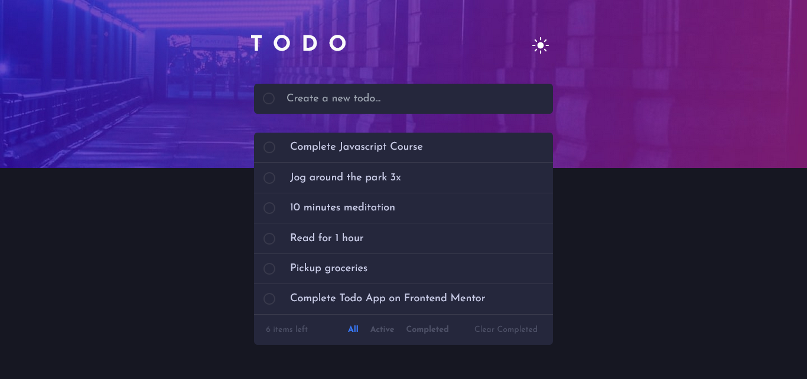

# Frontend Mentor - Todo app solution

This is a solution to the [Todo app challenge on Frontend Mentor](https://www.frontendmentor.io/challenges/todo-app-Su1_KokOW). Frontend Mentor challenges help you improve your coding skills by building realistic projects.

## Table of contents

- [Overview](#overview)
  - [The challenge](#the-challenge)
  - [Screenshot](#screenshot)
  - [Links](#links)
- [My process](#my-process)
  - [Built with](#built-with)
  - [What I learned](#what-i-learned)
  - [Continued development](#continued-development)
  - [Useful resources](#useful-resources)
- [Author](#author)
- [Acknowledgments](#acknowledgments)

**Note: Delete this note and update the table of contents based on what sections you keep.**

## Overview

### The challenge

Users should be able to:

- View the optimal layout for the app depending on their device's screen size
- See hover states for all interactive elements on the page
- Add new todos to the list
- Mark todos as complete
- Delete todos from the list
- Filter by all/active/complete todos
- Clear all completed todos
- Toggle light and dark mode
- **Bonus**: Drag and drop to reorder items on the list

### Screenshot

### Links

- Solution URL: [Add solution URL here](https://your-solution-url.com)
- Live Site URL: [Add live site URL here](https://your-live-site-url.com)

## My process

### Built with

- Semantic HTML5 markup
- Flexbox
- Mobile-first workflow
- [React](https://reactjs.org/) - JS library
- [Tailwind CSS](https://tailwindcss.com/) - For styles

### What I learned

Reflecting on this project, my major takeaways center around strengthening my proficiency in React. Specifically, I deepened my understanding and practical application of core React concepts, including:

- State management: I gained valuable experience in effectively utilizing state to manage dynamic data within components.
- Props: I improved my ability to pass data between components using props, facilitating efficient data flow.
- Conditional rendering: I learned to dynamically render different UI elements based on specific conditions, enhancing the application's responsiveness and user experience.

### Continued development

Moving forward, I want to concentrate on solidifying my understanding of more advanced React patterns. Specifically, I aim to delve deeper into:

- React Hooks: I'd like to explore advanced hook usage, beyond basic useState and useEffect, and understand how to create custom hooks for complex logic.
- Performance optimization: I want to refine my techniques for optimizing React applications, including memoization, code splitting, and efficient rendering strategies.
- Testing: I plan to dedicate more time to writing comprehensive unit and integration tests to ensure code robustness and maintainability.

### Useful resources

- [Tailwind CSS](https://tailwindcss.com/) - Tailwind CSS significantly improved my styling efficiency on this project. I found the utility-first workflow particularly helpful and will be using it going forward.

## Author

- Frontend Mentor - [@mrkmartin](https://www.frontendmentor.io/profile/mrkmartin)
- Github - [@mrkmartin](https://github.com/mrkmartin)
